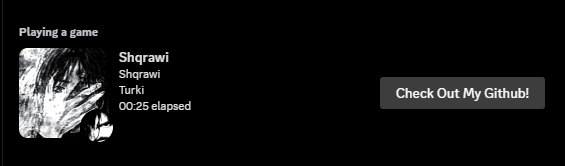

# Shqrawi's Custom Activity Status (RPC)

## Description
This is a simple js code that you use to put a custom activity in discord

## Required
- nodejs
- any text editor
- npm i discord-rpc
- contact shqrawi on discord for help!

## How To Run?
- index js can be run like any normal js file
- you need to make a discord application bot and replace the clientid with your apps client ID

